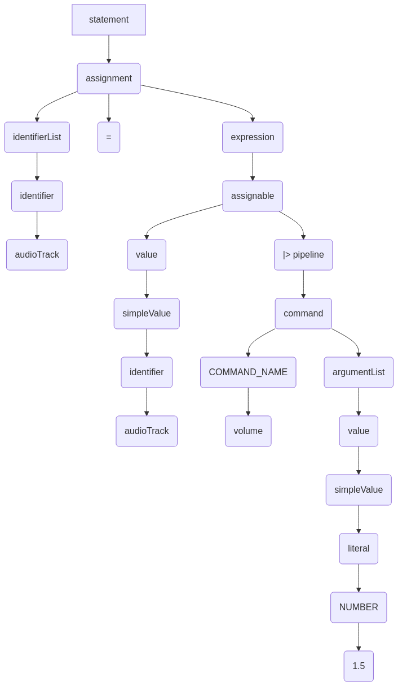
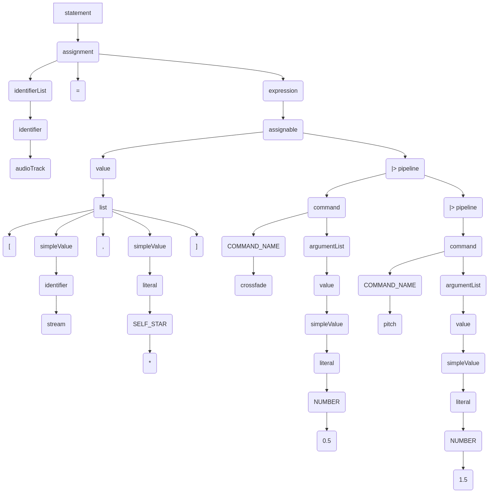

# VidLang DSL

Our VidLang DSL offers a straightforward approach to video and audio manipulation, centered around a pipeline-oriented methodology. Programs written in our DSL consist of commands, which can be chained together using the familiar pipe operator (`|>`). Tracks, representing audio and video streams, serve as the primary data type. Our language facilitates variable assignment, list construction, and the creation of subexpressions, enabling complex and parameterized operations. The global `stream` variable stores the result of the most recent pipeline. The self-reference operator `*` enables the construction of mutable statements.

```
#!/bin/venv vidlang

videoTrack, audioTrack := open "video.mp4"
introVid, introAud := open "intro.mp4"
outro, outroAud := open "outro.mp4"
audioTrack |> volume 1.5

# stream is a global variable representing the latest pipeline result

audioTrack = [stream, *]
		|> crossfade 0.5
		|> pitch 1.5

videoTrack =*
    |> brightness 1.3
    |> contrast 1.1

audSequence := [introAud, audioTrack, outroAud]
    |> map [i, el] ( el |> volume 0.5*i+1 )
vidSequence :=  [intoVid, videoTrack, outro]
trackline audSequence vidSequence
# or trackline audSequence [introVid, videoTrack, outro]
export "final.mp4"
```

## Specification and Analysis

### DSL Grammar

The structure of our VidLang DSL is formally defined using Extended Backus-Naur Form (EBNF):

```ebnf
program         = { statement } .
statement       = assignment | expression .
assignment      = identifierList ( ":=" | "=" ) expression .
identifierList  = identifier { "," identifier } .
expression      = assignable .
assignable      = value [ ( NEWLINE )  "|>" pipeline ] .
value           = list | simpleValue | mathExpr .
simpleValue     = identifier | literal .
literal         = STRING | NUMBER | BOOLEAN | SELF_STAR | STREAM .
list            = "[" [ simpleValue { "," simpleValue } ] "]" [ subExpression ] .
subExpression   = "[" identifierList "]" "(" assignable ")" .
pipeline        = command { "|>" command } .
command         = COMMAND_NAME [ argumentList ] .
argumentList    = value { value } .
mathExpr        = term .
term            = factor { ( "+" | "-" ) factor } .
factor          = primary { ( "*" | "/" ) primary } .
primary         = identifier | NUMBER | "(" mathExpr ")" .
identifier      = IDENTIFIER .

```

#### Lexical Elements

*   `IDENTIFIER`: A sequence of alphanumeric characters, beginning with a letter.
*   `STRING`: A sequence of characters enclosed in double quotes (`"`).
*   `NUMBER`: A sequence of digits, possibly including a decimal point.
*   `BOOLEAN`: `true` or `false`.
*   `SELF_STAR`: `*`.
*   `STREAM`: `stream`.
*   `COMMAND_NAME`: Keywords designating specific video/audio manipulation commands (e.g., `open`, `volume`, `crossfade`).
*   `NEWLINE`: A newline character (`\n`).

#### Syntactic Structures

*   **Program:** A sequence of statements.
*   **Statement:** Either an assignment or an expression.
*   **Assignment:** Assigns the result of an expression to one or more identifiers. Supports both declaration (`:=`) and assignment (`=`).
*   **Expression:** An `assignable` element which can be chained into a `pipeline`.
*   **Assignable**: Can be a `value` or `pipeline`.
*   **Value:** A `list`, a `simpleValue`, or a `mathExpr`.
*   **SimpleValue:** An `identifier` or a `literal`.
*   **Literal:** A `STRING`, `NUMBER`, `BOOLEAN`, `SELF_STAR` or `STREAM`.
*   **List:** An ordered collection of `simpleValue` elements enclosed in square brackets (`[]`). May be followed by a subexpression.
*   **SubExpression:** A parameter list, consisting of identifiers, and the subexpression body which is an `assignable` element.
*   **Pipeline:** A sequence of commands chained together using the pipe operator (`|>`).
*   **Command:** A `COMMAND_NAME` followed by an optional list of arguments.
*   **ArgumentList:** A sequence of `value` elements passed as arguments to a command.
*   **Math Expression**: A mathematical expression involving identifiers, numbers, and operators

#### Parse Trees

We provide two parse trees to represent our grammar better:

A simple transformation:
```
audioTrack |> volume 1.5

```



and a more complex one:
```
audioTrack = [stream, *]
    |> crossfade 0.5
    |> pitch 1.5
```



#### Complexity Analysis

With 20 production rules, our grammar is of **Medium** complexity. It exhibits shallow recursion in `term` and `factor` for math expressions (up to 3 levels), and in assignable (2 levels). Our grammar defines a moderate number of token types, including nested structures like lists and pipelines. It's unambiguous, assuming correct precedence handling in the `mathExpr` rules.

### 3. DSL Semantics

*   **Program:** Execution begins at the first statement and proceeds sequentially.
*   **Assignment:** The expression on the right-hand side is evaluated, and its result is bound to the identifier(s) on the left-hand side. If the `:=` operator is used, the identifier is declared within the current scope.
*   **Expression:** The expression is evaluated, and its result may be used as input to a subsequent command or stored in the global `stream` variable.
*   **Value:** Represents a data element.
    *   `STRING`: A string literal.
    *   `NUMBER`: A numerical literal (floating-point).
    *   `BOOLEAN`: A boolean literal (`true` or `false`).
    *   `SELF_STAR`: Refers to the value of the variable being assigned to.
    *   `STREAM`: Refers to the global stream variable, representing the output of the last pipeline.
    *   `IDENTIFIER`: Refers to the value bound to the identifier in the current scope.
*   **List:** A collection of values. Lists can be used as arguments to commands or as input to pipelines.
*   **SubExpression**: Binds the `identifierList` to the body, returning the value of the body with the identifiers in scope.
*   **Pipeline:** Each command within the pipeline is executed in sequence. The output of one command becomes the input to the subsequent command. The final output of the pipeline is assigned to the global `stream` variable.
*   **Command:** A function call with a specific name and a list of arguments. The semantics of each command (e.g., `open`, `volume`, `crossfade`) are defined by the underlying video/audio processing engine.
*   **ArgumentList:** The arguments passed to a command. Argument types must match the expected types of the command's parameters.
*   **Math Expression:** Evaluated according to standard mathematical precedence rules.

#### Possible Errors and Constraints

Several potential errors and constraints exist within our DSL:

*   Type mismatches: Passing an argument of the wrong type to a command.
*   Undefined identifiers: Referencing an identifier that has not been declared.
*   Invalid file paths: Providing an invalid file path to the `open` command.
*   Division by zero: Attempting to divide by zero in a mathematical expression.
*   Incorrect number of arguments: Passing the wrong number of arguments to a command.
*   Scope violations: Referencing an identifier that is not in the current scope.

## Lexer Theory and Implementation

### What is a Lexer?

A lexer (or lexical analyzer) is the first phase of a compiler or interpreter that converts a sequence of characters into a sequence of tokens. These tokens are meaningful chunks of the input that the parser can work with more easily. In our DSL for video processing (VidLang), the lexer plays a crucial role in identifying language constructs like variables, operators, commands, and literals.

### State Machine Approach

The lexer implementation is inspired by Rob Pike's approach in Go's `text/template` package, which combines state and action into a single concept: a **state function**. This creates an elegant state machine where each state knows what comes next.

```go
type stateFn func(*lexer) stateFn
```

This pattern is deceptively simple but incredibly powerful. Each state function processes some portion of the input and then returns the next state function to call. The beauty of this approach is that it completely eliminates the traditional state enumeration and giant switch statements you typically see in lexers. Instead, the control flow is expressed directly in code, making the lexer both more readable and more maintainable.

I was particularly drawn to this approach because it aligns perfectly with Go's strengths. The language's first-class functions allow state functions to be passed around effortlessly, and Go's concurrency features make it easy to set up a producer-consumer relationship between the lexer and parser.

### Lexer Structure

Our lexer maintains several fields to track its progress through the input string:

```go
type lexer struct {
    input         string    // string being scanned
    start         int       // start position of this item
    pos           int       // current input position
    startLine     int       // start line
    line          int       // current line
    width         int       // width of last rune read from input
    items         chan item // channel of scanned items
    allowSelfStar bool      // whether `*` is a selfstar or not
    reachedEOF    bool      // whether EOF has been reached
}
```

Each field serves a specific purpose in the lexing process. The `input` holds the entire script being processed, while `start` and `pos` mark the beginning and current position of the token being scanned. I track both the `startLine` and current `line` to provide meaningful error messages - this was a lesson learned from earlier iterations where debugging was unnecessarily difficult without proper line information.

The `width` field might seem unnecessary at first, but it's crucial for correctly handling Unicode characters when backing up. Go's UTF-8 handling is excellent, but you need to track character widths explicitly when manipulating strings at the byte level.

The `items` channel is where the magic happens for concurrency. By sending tokens through a channel, the lexer can run independently from the parser, potentially improving performance for longer scripts.

I added the `allowSelfStar` flag to tackle a common ambiguity in the language - the `*` character can mean multiplication or self-reference depending on context. This field tracks that context as we lex. Similarly, `reachedEOF` helps prevent redundant EOF tokens and simplifies control flow.

The lexer communicates with the parser through a channel of items:

```go
type item struct {
    typ itemType
    val string
    pos  int
    line int
}
```

Each item encapsulates everything the parser needs to know about a token. The `typ` field identifies what kind of token it is, while `val` contains the actual text from the script. The `pos` and `line` fields are invaluable for error reporting, allowing for specific error messages like "Unexpected token at line 5, position 23."

I also added a custom String() method to make debugging more pleasant:

```go
func (i item) String() string {
    switch {
    case i.typ == itemEOF:
        return "EOF"
    case i.typ == itemError:
        return i.val
    case i.typ > itemCommand:
        return fmt.Sprintf("cmd: %s", i.val)
    case len(i.val) > 10:
        return fmt.Sprintf("%.10q...", i.val)
    }
    return fmt.Sprintf("%q", i.val)
}
```

This might seem like a small detail, but it made a world of difference during development. Being able to print meaningful representations of tokens directly saved countless hours of debugging. The method handles special cases like EOF separately and truncates long tokens to prevent log bloat.

### Token Types

The language defines various token types as constants:

```go
type itemType int

const (
    itemError itemType = iota
    itemEOF
    itemIdentifier
    itemVariable
    // ... many more token types
)
```

Using an integer enum like this for token types is clean and efficient, but I did find myself occasionally wishing for Go's enums to be more expressive. In particular, being able to group related token types would have been helpful. I worked around this by using comments and consistent ordering to group tokens conceptually - operators together, delimiters together, commands together, and so on.

I started with `itemError` and `itemEOF` as the first two types because they're special cases that require specific handling. Having them at fixed positions makes certain logic more straightforward. The rest of the types follow a logical grouping that mirrors the language's structure.

One interesting choice was separating `itemIdentifier` and `itemVariable`. Initially, I tried treating them identically, but the language has subtle semantic differences between the two that became easier to handle by distinguishing them at the lexical level.

### Running the Lexer

The lexer starts at a designated state function (`lexScript`) and continues executing state functions until it returns `nil`:

```go
func run(l *lexer) {
    for state := lexScript; state != nil {
        state = state(l)
    }
    close(l.items)
}
```

This function is deceptively simple but encapsulates the entire lexing process. It begins with the `lexScript` state function and continues executing whatever state function is returned until one returns `nil`, which signals completion (or an unrecoverable error). After that, it closes the items channel to inform the parser that no more tokens are coming.

I initially had error handling directly in this function, but found that it was cleaner to handle errors through the item channel itself. This approach provides more flexibility in how errors are reported and handled by the parser.

The function is designed to be run as a goroutine (hence being called from a `go` statement in the `lex` function), which enables concurrent lexing and parsing:

```go
func lex(input string) *lexer {
    l := &lexer{
        input:         input,
        items:         make(chan item),
        allowSelfStar: false,
    }
    go run(l)
    return l
}
```

### Main Lexing Function

The main state function, `lexScript`, identifies the next token in the input:

```go
func lexScript(l *lexer) stateFn {
    if l.reachedEOF {
        l.emit(itemEOF)
        return nil
    }

    // Skip whitespace
    for isSpace(l.peek()) {
        l.next()
        l.ignore()
    }

    r := l.next()
    switch {
    case r == eof:
        l.emit(itemEOF)
        return nil
    case r == '#':
        return lexComment
    case r == '"':
        return lexString
    case unicode.IsDigit(r):
        l.backup()
        return lexNumber
    case isAlphaNumeric(r):
        l.backup()
        return lexIdentifier
    }

    // Handle operators and delimiters
    if op, ok := runeKeywords[r]; ok {
        // Special handling for * and other contextual tokens
        if op == itemMult && l.allowSelfStar {
            op = itemSelfStar
        }
        // Update context for parsing
        if op == itemAssign || op == itemLeftBrace {
            l.allowSelfStar = true
        }
        if op == itemRightParen {
            l.allowSelfStar = false
        }
        l.emit(op)
        return lexScript
    }

    // Handle multi-rune operators
    w := string(r)
    p := l.next()
    if p == eof {
        l.emit(itemEOF)
        return nil
    }
    w += string(p)
    if op, ok := strOperators[w]; ok {
        l.emit(op)
        if op == itemDeclare {
            l.allowSelfStar = true
        }
        if op == itemPipe {
            l.allowSelfStar = false
        }
        return lexScript
    }

    return l.errorf("unexpected character %#U", r)
}
```

This is the workhorse of our lexer, responsible for dispatching to more specific lexing functions based on what it encounters. The function first checks if we've already seen an EOF to prevent redundant processing. Then it handles whitespace, which was surprisingly finicky - in early versions, I had bugs related to whitespace handling that were difficult to track down.

After that, it uses a switch statement to check for specific characters that trigger specialized lexing states. I arranged these in rough order of frequency to optimize performance slightly. The calls to `l.backup()` before returning certain state functions might seem odd, but they're necessary because we've already consumed a character with `l.next()` and some specialized lexers expect to see that first character.

The operator handling showcases the context-sensitivity of our lexer. The `*` token is particularly ambiguous - it can be either multiplication or a self-reference depending on context. The `allowSelfStar` flag tracks whether we're in a context where self-reference is valid. This contextual lexing was tricky to get right, but it makes the parser's job much simpler.

Multi-rune operators like `:=` and `|>` require special handling since they need to be recognized as single tokens. I initially tried using a more generic approach with prefix trees, but found that a simple string concatenation and map lookup was more than sufficient for our small set of operators.

If no known token pattern is matched, we call `errorf` to report an unexpected character error. This function both sends an error token through the channel and shuts down the lexer by returning `nil`.

### Specialized Lexing Functions

Different token types require specialized handling:

#### Comments

```go
func lexComment(l *lexer) stateFn {
    for l.peek() == '#' {
        l.next()
        l.ignore()
    }
    for {
        c := l.next()
        switch c {
        case '\n':
            l.emit(itemComment)
            return lexScript
        case eof:
            l.emit(itemComment)
            l.emit(itemEOF)
            return nil
        }
    }
}
```

Comments in VidLang are straightforward - they start with `#` and continue to the end of the line. This function first skips any additional `#` characters (allowing for multi-hash comments like `##` for documentation), then consumes everything until a newline or EOF.

I decided to emit comments as tokens rather than ignoring them entirely, which is useful for documentation tools that might want to extract comments. The function handles two termination cases: a newline (where we return to `lexScript`) or an EOF (where we emit both the comment token and an EOF token before terminating).

An interesting edge case is when a comment appears at the end of the file without a trailing newline. I struggled with this until I added specific handling for EOF within the comment lexer.

#### Identifiers

```go
func lexIdentifier(l *lexer) stateFn {
    var r rune
    for r = l.next(); isAlphaNumeric(r); {
        r = l.next()
    }
    l.backup()

    word := l.input[l.start:l.pos]

    // Check if it's a command
    if item, ok := commands[word]; ok {
        l.emit(item)
        return lexScript
    }

    // Special keywords
    switch word {
    case globalStream:
        l.emit(itemStream)
    default:
        l.emit(itemIdentifier)
    }
    if r == eof {
        l.emit(itemEOF)
        return nil
    }
    return lexScript
}
```

The identifier lexer handles variable names, commands, and keywords. It first accumulates alphanumeric characters, then checks if the resulting word is special in some way.

I initially used a single map for all keywords, but found that separating commands into their own map made the code more maintainable as I added new video processing commands. The command map lets us emit specific token types for each command, which helps the parser implement command-specific behavior.

The handling of `globalStream` as a special keyword was an interesting design choice. I debated whether to treat it as a built-in variable or a language keyword, eventually settling on the latter to make its special role in the language more explicit.

I also made sure to check for EOF after identifying the token, which prevents the lexer from unnecessarily returning to `lexScript` only to immediately encounter an EOF.

#### Numbers

```go
func lexNumber(l *lexer) stateFn {
    // Optional leading sign
    l.accept("+-")
    // Is it a number?
    digits := "0123456789"
    l.acceptRun(digits)

    // Decimal point?
    if l.accept(".") {
        l.acceptRun(digits)
    }

    l.emit(itemNumber)
    return lexScript
}
```

Number lexing is relatively straightforward, handling both integers and floating-point values. The `accept` and `acceptRun` helper functions are particularly useful here, making the code much cleaner than explicit character-by-character checking.

I consciously chose not to support scientific notation (e.g., `1.23e-4`) because it wasn't necessary for our video processing DSL. Adding such support would be a simple extension if needed later.

One subtlety is that I don't validate that there's at least one digit before or after the decimal point. This allows formats like `.5` and `5.`, which some languages reject. For our DSL, this flexibility seemed reasonable and natural.

#### Strings

```go
func lexString(l *lexer) stateFn {
    for {
        r := l.next()
        if r == eof {
            return l.errorf("unterminated string")
        }
        if r == '\\' {
            // Handle escape sequence
            r = l.next()
            if r == eof {
                return l.errorf("unterminated string escape")
            }
            continue
        }
        if r == '"' {
            break
        }
    }
    l.emit(itemString)
    return lexScript
}
```

String lexing requires careful handling of escape sequences. The function consumes characters until it finds a closing quote, handling backslash escapes along the way. If it encounters EOF before a closing quote, it reports an error.

I realized during implementation that proper handling of escape sequences is surprisingly tricky. The function currently just skips over the escaped character without validating it, which is fine for basic use but could be enhanced to verify that only valid escape sequences are used.

Another consideration was whether to interpret escape sequences during lexing (e.g., converting `\n` to a newline character) or leave that to the parser. I chose the latter approach for simplicity, though either would work well.

### Helper Functions

The lexer includes several helper functions:

```go
// emit sends an item back to the client
func (l *lexer) emit(t itemType) {
    l.items <- item{t, l.input[l.start:l.pos], l.start, l.startLine}
    l.start = l.pos
    l.startLine = l.line
}
```

The `emit` function is the bridge between the lexer and parser, sending a new token through the items channel. It's deceptively simple but does several important things at once: creating the token with the right type and value, resetting the start position to prepare for the next token, and updating the start line for error reporting.

```go
// next returns the next rune in the input
func (l *lexer) next() rune {
    if int(l.pos) >= len(l.input) {
        l.reachedEOF = true
        return eof
    }
    r, w := utf8.DecodeRuneInString(l.input[l.pos:])
    l.pos += w
    if r == '\n' {
        l.line++
    }
    return r
}
```

The `next` function is the heart of character-by-character lexing. It advances through the input, handling UTF-8 characters correctly (thanks to Go's built-in support), and tracking line numbers. The `reachedEOF` flag helps prevent infinite loops and redundant EOF tokens.

```go
// peek returns but does not consume the next rune
func (l *lexer) peek() rune {
    r := l.next()
    l.backup()
    return r
}
```

The `peek` function is a convenience that lets us look at the next character without consuming it. This is especially useful for lookahead operations like checking if a comment contains additional `#` characters.

```go
// backup steps back one rune
func (l *lexer) backup() {
    if l.pos > 0 {
        r, w := utf8.DecodeLastRuneInString(l.input[:l.pos])
        l.pos -= w
        // Correct newline count
        if r == '\n' {
            l.line--
        }
    }
}
```

The `backup` function is trickier than it first appears because we need to handle UTF-8 characters correctly. It steps back one character and adjusts the line count if necessary. Getting this right was essential for the lexer to work correctly with non-ASCII text.

```go
// accept consumes the next rune if it's from the valid set
func (l *lexer) accept(valid string) bool {
    if strings.ContainsRune(valid, l.next()) {
        return true
    }
    l.backup()
    return false
}

// acceptRun consumes a run of runes from the valid set
func (l *lexer) acceptRun(valid string) {
    for strings.ContainsRune(valid, l.next()) {
    }
    l.backup()
}
```

These convenience functions make the code much more readable when consuming characters that match certain patterns. The `accept` function handles optional characters (like the sign in a number), while `acceptRun` efficiently consumes repeated characters (like digits).

```go
// ignore skips over the pending input before this point
func (l *lexer) ignore() {
    l.line += strings.Count(l.input[l.start:l.pos], "\n")
    l.start = l.pos
    l.startLine = l.line
}
```

The `ignore` function is used to discard input that doesn't contribute to tokens, like whitespace. It's important that it correctly updates line counts for accurate error reporting. I initially missed this, which led to confusing error messages until I fixed it.

### Context Sensitivity

An interesting aspect of our lexer is its context sensitivity. For example, the `*` character can be interpreted either as a multiplication operator or as a "self-star" reference (similar to `this` in other languages) depending on the context:

```go
if op == itemMult && l.allowSelfStar {
    op = itemSelfStar
}
```

This context sensitivity was one of the trickier parts of the lexer to get right. The language's syntax allows `*` to mean multiplication in expressions like `0.5*i+1`, but it's also used for self-reference in contexts like `videoTrack =*`. Distinguishing between these uses requires tracking the syntactic context.

The `allowSelfStar` boolean is toggled based on specific tokens that change the context:

```go
if op == itemAssign || op == itemLeftBrace {
    l.allowSelfStar = true
}
if op == itemRightParen {
    l.allowSelfStar = false
}
```

This approach felt a bit hacky at first - I was essentially leaking parser knowledge into the lexer - but it actually worked really well in practice. The alternative would have been to make the parser disambiguate the `*` token based on context, which would have been more complex.

Similar context tracking is done for multi-rune operators:

```go
if op, ok := strOperators[w]; ok {
    l.emit(op)
    if op == itemDeclare {
        l.allowSelfStar = true
    }
    if op == itemPipe {
        l.allowSelfStar = false
    }
    return lexScript
}
```

The `:=` declaration operator and `|>` pipe operator also affect whether `*` should be interpreted as self-reference. This pattern of tracking context through state worked well, though it did require careful thought about how each operator affects the syntax.

## Code Example and Output

Let's examine how the lexer processes a simple VidLang script:

```go
func main() {
    testScript := `
#!/bin/venv vidlang
videoTrack, audioTrack := open "video.mp4"
introVid, introAud := open "intro.mp4"
outro, outroAud := open "outro.mp4"
audioTrack |> volume 1.5
# stream is a global variable representing the latest pipeline result
audioTrack = [stream, *]
    |> crossfade 0.5
    |> pitch 1.5
videoTrack =*
    |> brightness 1.3
    |> contrast 1.1
sequence := [introAud, audioTrack, outroAud]
    |> map [i, el] ( el |> volume 0.5*i+1 )
trackline [intoVid, videoTrack, outro] sequence
export "final.mp4"
`
    l := lex(testScript)
    for {
        item := <-l.items
        if item.typ == itemEOF {
            break
        }
        fmt.Printf("%#v\n", item)
        if item.typ == itemError {
            os.Exit(1)
        }
    }
}
```

This script demonstrates many of the language features: variable declarations, function calls, pipelines, self-references, and comments. The lexer breaks it down into a stream of tokens that the parser can then assemble into a meaningful program.

When running this example, you'll see each token printed with its type, value, and position information. This output is invaluable for debugging the lexer itself and understanding how the language is interpreted.

I deliberately chose a script that exercises most of the interesting parts of the lexer, especially the context-sensitive handling of the `*` token. Looking at a complex script like this helped me catch several edge cases during development.

## Design Considerations

### Channel-Based Communication

The lexer communicates with its consumer through a channel, enabling concurrent operation. This is particularly useful for a language processing video streams, where parallelism is beneficial:

```go
func lex(input string) *lexer {
    l := &lexer{
        input:         input,
        items:         make(chan item),
        allowSelfStar: false,
    }
    go run(l)
    return l
}
```

Using a channel for communication is one of my favorite aspects of this design. It neatly decouples the lexer from its consumer (usually the parser) and allows them to work concurrently. The lexer can be scanning ahead while the parser is still processing earlier tokens, which should improve performance for larger scripts.

This approach leverages Go's goroutines and channels to create a natural producer-consumer relationship. The lexer produces tokens and sends them through the channel, while the parser consumes them at its own pace. The channel acts as a buffer, smoothing out any speed differences between the two.

One limitation is that the channel has no built-in backpressure mechanism - if the lexer runs much faster than the parser, it could potentially build up a large number of tokens in memory. In practice, this hasn't been an issue, but it's something to be aware of.

### Error Handling

The lexer includes robust error handling with detailed position information:

```go
func (l *lexer) errorf(format string, args ...any) stateFn {
    l.items <- item{itemError, fmt.Sprintf(format, args...), l.start, l.startLine}
    l.start = 0
    l.pos = 0
    l.input = l.input[:0]
    return nil
}
```

Error handling was a priority from the beginning. The `errorf` function does three important things: it sends an error token with a formatted message through the channel, resets the lexer state to prevent further lexing, and returns `nil` to terminate the lexing process.

I initially had a more complex error handling system that tried to recover from errors and continue lexing, but found that it often just led to cascading errors that were harder to debug. The current approach of stopping at the first error and providing a clear message proved more practical.

Including the position information (line and character position) in the error token made a huge difference in usability. It allows the parser or other tools to generate user-friendly error messages like "Unexpected character '?' at line 5, position 23" rather than just "Syntax error."

### Operator and Command Recognition

The lexer uses maps to efficiently recognize operators and commands:

```go
var runeKeywords = map[rune]itemType{
    '(':  itemLeftParen,
    ')':  itemRightParen,
    ',':  itemComma,
    '[':  itemLeftBrace,
    ']':  itemRightBrace,
    '\n': itemNewline,

    '_': itemUnderscore,

    '*': itemMult,
    '+': itemPlus,
    '-': itemMinus,
    '/': itemDiv,
    '=': itemAssign,
}

var strOperators = map[string]itemType{
    ":=": itemDeclare,
    "|>": itemPipe,
    "..": itemConcatOp,
}

var commands = map[string]itemType{
    "brightness": itemBrigtness,
    "concat":     itemConcat,
    "contrast":   itemContrast,
    "crossfade":  itemCrossfade,
    "cut":        itemCut,
    "fade":       itemFade,
    "hue":        itemHue,
    "map":        itemMap,
    "open":       itemOpen,
    "pitch":      itemPitch,
    "saturation": itemSaturation,
    "speed":      itemSpeed,
    "trackline":  itemTrackLine,
    "volume":     itemVolume,
}
```

Using maps for lookups is both efficient and maintainable. It's easy to add new operators or commands just by adding entries to these maps, without modifying the core lexing logic.

I separated single-rune operators, multi-rune operators, and commands into different maps for clarity. This separation reflects the different ways these elements are detected in the lexer. Single-rune operators can be identified with a simple lookup after reading one character, while multi-rune operators require reading two characters and checking a different map.

The command map serves as both a lookup table and a validation mechanism - if a word exists in the commands map, it's a valid command. This allowed me to add helper functions like `isCommand()` that simplified command detection:

```go
func isCommand(s string) bool {
    _, ok := commands[s]
    return ok
}
```

Similarly for multi-rune operators:

```go
func isStrOperator(s string) bool {
    _, ok := strOperators[s]
    return ok
}
```

These helper functions made the code more readable in places where I just needed to check if something was a command or operator without caring about the specific type.

## Parser Theory and Implementation

### What is a Parser?

The parser takes the stream of tokens produced by the lexer and constructs an Abstract Syntax Tree (AST). The AST represents the grammatical structure of the input script, making it easier to analyze, optimize, and execute. In our VidLang DSL, the parser is responsible for recognizing language constructs like assignments, expressions, commands, and pipelines.

### Recursive Descent Parsing

We've implemented a recursive descent parser. This approach mirrors the grammar of the language directly in the code, with each non-terminal in the grammar having a corresponding parsing function.

```go
func (p *parser) parseCommand() nodeCommand { ... }
func (p *parser) parseValue() nodeValue { ... }
func (p *parser) parseAssignable() nodeValue { ... }
```

This direct mapping makes the parser relatively easy to understand and maintain. Each function is responsible for parsing a specific grammatical construct, and it calls other parsing functions to handle sub-constructs. Error handling can be localized to specific parsing functions, which simplifies debugging.

I chose recursive descent because it's a good balance between simplicity and expressiveness. It's easier to implement and debug than more complex parsing algorithms like LR or LALR, while still being powerful enough to handle our DSL.

### Parser Structure

The parser maintains several fields to track its progress through the token stream and manage its state:

```go
type parser struct {
	lex         *lexer         // lexer that produces tokens
	expressions chan node        // channel for parsed expressions
	currItem    item           // current item
	peekItem    item           // next item
	peek2Item   item           // item after next
	identSet    map[string]*identifier // set of declared identifiers
}
```

The `lex` field holds the lexer, which provides the stream of tokens. The `expressions` channel is where the parser sends the constructed AST nodes. The `currItem`, `peekItem`, and `peek2Item` fields allow the parser to look ahead in the token stream. This lookahead is crucial for making parsing decisions, such as distinguishing between assignments and expressions. The `identSet` map keeps track of declared identifiers and their types. This is used for semantic analysis, such as checking for duplicate declarations or type mismatches.

I opted for a three-token lookahead (`currItem`, `peekItem`, `peek2Item`) because it was necessary to handle certain syntactic ambiguities in the language. For example, when encountering an identifier, we need to look at the next two tokens to determine if it's part of an assignment, an expression, or a command.

The `expressions` channel is a critical part of the design. Like the lexer, the parser operates concurrently, sending parsed nodes through the channel. This allows for asynchronous processing of the script, potentially improving performance.

### Node Types

The parser constructs various types of nodes to represent the different language constructs:

```go
type nodeValue interface {
	valueType() valueType
	String() string
}

type nodeLiteralString string
type nodeLiteralNumber float64
type nodeLiteralBool bool
type nodeIdent string
type nodeSelfStar struct{ self string }
type nodeSubExpr struct { body nodeValue; params nodeList[nodeIdent] }
type nodeExprMath struct { left nodeValue; op itemType; right nodeValue }
type nodeCommand struct { name string; args []nodeValue }
type nodePipeline []nodeCommand
type nodeExpr struct { input nodeList[nodeValue]; pipeline nodePipeline }
type nodeAssign struct { dest nodeList[nodeIdent]; value nodeValue; define bool }
```

These node types represent the different values, expressions, commands, and control structures in VidLang. Each node type implements the `nodeValue` interface, which provides a common way to access the node's type and string representation.

The `nodeExpr` type represents a complete expression, including its input (which can be a list of values) and its pipeline of commands. The `nodeAssign` type represents an assignment statement, including the destination variables, the assigned value, and whether the assignment is a declaration.

I put a lot of thought into the design of these node types. They need to be expressive enough to represent all the language constructs, while also being simple enough to be easily manipulated by subsequent compiler passes.

### Running the Parser

The `parse` function initializes the parser and starts the parsing process in a goroutine:

```go
func parse(input string) *parser {
	p := &parser{
		lex:         lex(input),
		expressions: make(chan node),
		identSet:    make(map[string]*identifier),
	}
	p.currItem = <-p.lex.items
	p.peekItem = <-p.lex.items
	p.peek2Item = <-p.lex.items
	go p.run()
	return p
}
```

The `parse` function creates a new parser, initializes its fields, and starts the `run` method in a goroutine. The `run` method consumes tokens from the lexer and constructs the AST.

The initial consumption of three items from the lexer channel primes the lookahead buffer. The `run` method is the main loop of the parser, processing tokens until it encounters an EOF token.

### Main Parsing Loop

The `run` method is the heart of the parser:

```go
func (p *parser) run() {
	for {
		p.nextItem()
		switch p.currItem.typ {
		case itemEOF:
			close(p.expressions)
			return
		case itemIdentifier:
			// Check for assignment-like conditions
			switch p.peekItem.typ {
			case itemAssign, itemDeclare, itemComma:
				p.expressions <- p.parseAssignment()
			case itemPipe:
				p.expressions <- p.parseAssignable()
			}
		case itemLeftBrace, itemNumber, itemString, itemBool:
			p.expressions <- p.parseAssignable()
		default:
			if p.currItem.typ > itemCommand {
				p.expressions <- p.parseAssignable()
			} else {
			}
		}
	}
}
```

The `run` method iterates through the token stream, dispatching to different parsing functions based on the current token type. The lookahead is crucial for deciding which parsing function to call. For example, if the current token is an identifier and the next token is an assignment operator or a declaration operator, then the parser calls the `parseAssignment` function. Otherwise, it calls the `parseAssignable` function.

The `parseAssignable` function handles values and expressions that can be assigned to variables or used as inputs to pipelines.

### Parsing Functions

The parser includes several parsing functions, each responsible for parsing a specific grammatical construct:

#### Assignments

```go
func (p *parser) parseAssignment() nodeAssign {
	var node nodeAssign

	node.dest = p.parseIdentList()

	if p.currItem.typ == itemDeclare {
		node.define = true
	} else if p.currItem.typ != itemAssign {
		p.errorf("expected assignment or declaration, got %s", p.peekItem)
	}

	p.nextItem()

	for p.currItem.typ == itemNewline {
		p.nextItem()
	}

	node.value = p.parseAssignable()

	return node
}
```

The `parseAssignment` function parses assignment statements, including both variable declarations and regular assignments. It first parses the list of destination variables using the `parseIdentList` function. Then, it checks whether the assignment is a declaration (using the `:=` operator) or a regular assignment (using the `=` operator). Finally, it parses the assigned value using the `parseAssignable` function.

The function handles newlines between the assignment operator and the assigned value, which allows for multi-line assignments.

#### Identifiers Lists

```go
func (p *parser) parseIdentList() nodeList[nodeIdent] {
	var idents nodeList[nodeIdent]
	for p.currItem.typ == itemIdentifier {

		idents = append(idents, nodeIdent(p.currItem.val))
		p.nextItem()

		if p.currItem.typ == itemComma {
			p.nextItem()
		}

	}
	return idents
}
```

The `parseIdentList` function parses a list of identifiers separated by commas. This is used in assignment statements to assign values to multiple variables at once.

#### Values

```go
func (p *parser) parseValue() nodeValue {
	assert(validValues[p.currItem.typ],
		"parseValue should be invoked with currItem at a simple value, list or subexpression got %s",
		p.currItem)

	var n nodeValue

	if p.currItem.typ == itemLeftBrace {
		n = p.parseSimpleValueList()
		assert(
			p.currItem.typ == itemRightBrace, "assumed that the list was terminated successfully by a right brace, but got %s -> %s", p.currItem, p.peekItem)
		if p.peekItem.typ == itemLeftParen {
			n = p.parseSubExpr(n)
		}
	} else if (p.currItem.typ == itemNumber || p.currItem.typ == itemLeftParen) && p.peekItem.typ == mathSymbols[p.peekItem.val] {
		n = p.parseMathExpression()
	} else {
		n = p.parseSimpleValue()
	}

	return n
}
```

The `parseValue` function is responsible for parsing simple values, lists, and subexpressions. It uses the `validValues` map to check whether the current token is a valid value.

If the current token is a left brace, then the parser calls the `parseSimpleValueList` function to parse a list of values. If the current token is a number or a left parenthesis, and the next token is a mathematical operator, then the parser calls the `parseMathExpression` function to parse a mathematical expression. Otherwise, the parser calls the `parseSimpleValue` function to parse a simple value (such as a number, string, or identifier).

If a `subExpr` is the next item, continue parsing for that

#### Assignable

```go
func (p *parser) parseAssignable() nodeValue {
	assert(validValues[p.currItem.typ] || p.currItem.typ > itemCommand,
		"parseValue should be invoked with currItem at a simple value, list, subexpression or command, got %s",
		p.currItem)

	var n nodeValue

	if validValues[p.currItem.typ] {
		n = p.parseValue()

		if p.peekItem.typ == itemNewline && p.peek2Item.typ == itemPipe {
			p.nextItem()
		}

		if p.peekItem.typ == itemPipe { // TODO:
			p.nextItem()
		}

		if p.currItem.typ == itemPipe {
			p.nextItem()
			if n.valueType() != valueList {
				n = nodeList[nodeValue]{n}
			}
			n = nodeExpr{input: n.(nodeList[nodeValue]), pipeline: p.parsePipeline()}
		}
	} else if p.currItem.typ > itemCommand {
		n = nodeExpr{pipeline: p.parsePipeline(), input: nil}
	}

	return n
}
```

The `parseAssignable` function is responsible for parsing values that can be assigned to variables or used as inputs to pipelines. It first parses a value using the `parseValue` function. Then, it checks whether the next token is a pipe operator (`|>`). If it is, then the parser calls the `parsePipeline` function to parse a pipeline of commands.

#### Subexpressions

```go
func (p *parser) parseSubExpr(v nodeValue) nodeSubExpr {

	assert(v.valueType() == valueList,
		"parseSubExpr's argument is assumed to be a list, but got %s", p.currItem)

	argList := make(nodeList[nodeIdent], 0)
	for _, arg := range v.(nodeList[nodeValue]) {
		if arg.valueType() != valueIdentifier {
			p.errorf("a subexpression's argument list must be a list of identifiers, but got %s", arg)
		}
		argList = append(argList, arg.(nodeIdent))
	}

	var n nodeSubExpr
	n.params = argList

	p.nextItem()
	n.body = p.parseSubExprBody()

	return n
}

// TODO hangle empty body case `()`
func (p *parser) parseSubExprBody() nodeValue {
	assert(p.currItem.typ == itemLeftParen,
		"parseSubExprBody should be invoked with currItem at left paren (the beginning of its body), got %s",
		p.currItem)
	p.nextItem()

	n := p.parseAssignable()
	// TODO: This is a temporary fix! Very bad should be done something else
	if p.currItem.typ != itemRightParen {
		p.nextItem()
	}

	if p.currItem.typ != itemRightParen {
		p.errorf("expected right paren at the end of subexpression body, got %s -> %s", p.currItem, p.peekItem)
	}
	//p.nextItem()

	return n
}
```

The `parseSubExpr` and `parseSubExprBody` functions are responsible for parsing subexpressions, which are anonymous functions that can be passed as arguments to commands. A subexpression consists of a list of parameter names enclosed in square brackets, followed by an expression enclosed in parentheses.

#### Pipelines

```go
func (p *parser) parsePipeline() nodePipeline {
	node := make(nodePipeline, 0)

	assert(p.currItem.typ > itemCommand,
		"parsePipeline should be invoked with currItem at a command, got %s", p.currItem)

	for p.currItem.typ > itemCommand {

		node = append(node, p.parseCommand())
		if p.peekItem.typ == itemNewline && p.peek2Item.typ == itemPipe {
			p.nextItem()
		}
		if p.peekItem.typ != itemPipe {
			break
		}
		p.nextItem()
		if p.peekItem.typ < itemCommand {
			p.errorf("expected command after pipe, got %s", p.peekItem)
		}
		p.nextItem()
	}

	return node
}
```

The `parsePipeline` function parses a pipeline of commands, which are chained together using the pipe operator (`|>`). Each command in the pipeline is parsed using the `parseCommand` function.

#### Commands

```go
func (p *parser) parseCommand() nodeCommand {
	var node nodeCommand
	node.name = p.currItem.val
	node.args = make([]nodeValue, 0)
	for validArgs[p.peekItem.typ] && p.peekItem.typ != itemNewline {
		p.nextItem()
		assert(
			validArgs[p.currItem.typ],
			"parseCommand's loop should be entered with a valid arg, but got %s",
			p.currItem)
		assert(
			p.currItem.typ != itemNewline,
			"parseCommand's loop should not process newlines",
		)
		node.args = append(node.args, p.parseValue())
	}
	return node
}
```

The `parseCommand` function parses a command, including its name and arguments. The command name is the current token. The arguments are parsed using the `parseValue` function and are appended to the command's argument list.

#### Simple Value Lists

```go
func (p *parser) parseSimpleValueList() nodeList[nodeValue] {
	list := make(nodeList[nodeValue], 0)
	assert(p.currItem.typ == itemLeftBrace, "parseSimpleValueList should be invoked with currItem at left brace, got %s", p.currItem)
	for p.currItem.typ != itemRightBrace {
		p.nextItem()
		list = append(list, p.parseSimpleValue())
		p.nextItem()
		if p.currItem.typ != itemComma {
			if p.currItem.typ != itemRightBrace {
				p.errorf("list not terminated properly, expected comma or right brace, got %s", p.currItem)
			}
			break
		}
	}
	assert(
		p.currItem.typ == itemRightBrace,
		"it was assumed that the list was terminated by a right brace but got %s -> %s", p.currItem, p.peekItem)
	return list
}
```

The `parseSimpleValueList` function parses a list of simple values enclosed in square brackets. The values are separated by commas.

#### Simple Values

```go
func (p *parser) parseSimpleValue() nodeValue {
	assert(
		validValues[p.currItem.typ],
		"parseSimpleValue should be invoked with a valid value, but got %s", p.currItem,
	)
	var n nodeValue
	switch p.currItem.typ {
	case itemIdentifier, itemSelfStar, itemStream:
		n = nodeIdent(p.currItem.val)
	case itemNumber:
		n = nodeLiteralNumber(strToLiteralNumber(p.currItem.val))
	case itemBool:
		n = nodeLiteralBool(strToLiteralBool(p.currItem.val))
	case itemString:
		n = nodeLiteralString(p.currItem.val)
	default:
		p.errorf("parseSimpleValue should be invoked with a valid value, but got %s", p.currItem)
	}
	//p.nextItem()
	return n
}
```

The `parseSimpleValue` function parses a simple value, such as a number, string, identifier, boolean, or self-star reference.

#### Math Expressions

```go
func (p *parser) parseMathExpression() nodeValue {
	return p.parseTerm()
}

func (p *parser) parseTerm() nodeValue {
	node := p.parseFactor()
	for p.currItem.typ == itemPlus || p.currItem.typ == itemMinus {
		op := p.currItem.typ
		p.nextItem()
		node = nodeExprMath{left: node, op: op, right: p.parseFactor()}
	}
	return node
}

func (p *parser) parseFactor() nodeValue {
	node := p.parsePrimary()
	for p.currItem.typ == itemMult || p.currItem.typ == itemDiv {
		op := p.currItem.typ
		p.nextItem()
		node = nodeExprMath{left: node, op: op, right: p.parsePrimary()}
	}
	return node
}

func (p *parser) parsePrimary() nodeValue {
	switch p.currItem.typ {
	case itemIdentifier:
		node := nodeIdent(p.currItem.val)
		p.nextItem()
		return node
	case itemNumber:
		node := strToLiteralNumber(p.currItem.val)
		p.nextItem()
		return node
	case itemLeftParen:
		p.nextItem()
		node := p.parseMathExpression()
		if p.currItem.typ != itemRightParen {
			p.errorf("missing closing parenthesis")
		}
		p.nextItem()
		return node
	default:
		p.errorf("unexpected token in expression %s", p.currItem)
		return nil
	}
}
```

The `parseMathExpression`, `parseTerm`, `parseFactor`, and `parsePrimary` functions are responsible for parsing mathematical expressions. These functions implement a standard recursive descent parser for arithmetic expressions with operator precedence.

### Helper Functions

The parser includes several helper functions:

```go
// nextItem advances the parser to the next token, and sets the peekItem
func (p *parser) nextItem() {
	if p.currItem.typ == itemError {
		p.errorf("lexical error: %s", p.currItem.val)
	}
	p.currItem = p.peekItem
	p.peekItem = p.peek2Item
	p.peek2Item = <-p.lex.items

}
```

The `nextItem` function advances the parser to the next token in the stream. It also handles lexical errors by calling the `errorf` function.

```go
func (p *parser) errorf(format string, args ...any) {
	err := fmt.Errorf(format, args...)
	panic(err)
}
```

The `errorf` function reports a parsing error and halts the parsing process. It formats the error message using the provided format string and arguments, and then panics.

```go
func assert(condition bool, msg string, args ...any) {
	if !condition {
		panic(fmt.Errorf("assertion failed: "+msg, args...))
	}
}
```

The `assert` function checks a condition and panics if the condition is false. This is used for internal consistency checks in the parser.

## Code Example and Output

Let's examine how the parser processes the same VidLang script as in the lexer section:

```go
func main() {
    testScript := `
#!/bin/venv vidlang
videoTrack, audioTrack := open "video.mp4"
introVid, introAud := open "intro.mp4"
outro, outroAud := open "outro.mp4"
audioTrack |> volume 1.5
# stream is a global variable representing the latest pipeline result
audioTrack = [stream, *]
    |> crossfade 0.5
    |> pitch 1.5
videoTrack =*
    |> brightness 1.3
    |> contrast 1.1
sequence := [introAud, audioTrack, outroAud]
    |> map [i, el] ( el |> volume 0.5*i+1 )
trackline [intoVid, videoTrack, outro] sequence
export "final.mp4"
`
    p := parse(testScript)
    for node := range p.expressions {
        printNode(node)
    }
}
```

This script demonstrates many of the language features: variable declarations, function calls, pipelines, self-references, and comments. The parser will transform it into a series of AST nodes.

When running this example, you'll see each node printed with its type and value information. This output is invaluable for debugging the parser itself and understanding how the language is interpreted.

The generated output would consist of the printed representation of the parsed nodes, for example:
```
main.nodeAssign{dest:main.nodeList[main.nodeIdent]{[]main.nodeIdent{main.nodeIdent("videoTrack"), main.nodeIdent("audioTrack")}, 2}, value:main.nodeExpr{input:nil, pipeline:main.nodePipeline{main.nodeCommand{name:"open", args:[]main.nodeValue{main.nodeLiteralString("video.mp4")}}}}, define:true}
main.nodeAssign{dest:main.nodeList[main.nodeIdent]{[]main.nodeIdent{main.nodeIdent("introVid"), main.nodeIdent("introAud")}, 2}, value:main.nodeExpr{input:nil, pipeline:main.nodePipeline{main.nodeCommand{name:"open", args:[]main.nodeValue{main.nodeLiteralString("intro.mp4")}}}}, define:true}
...
```

## Design Considerations

### Three-Token Lookahead

The parser uses a three-token lookahead to handle syntactic ambiguities:

```go
type parser struct {
	lex         *lexer
	expressions chan node
	currItem    item
	peekItem    item
	peek2Item   item
	identSet    map[string]*identifier
}
```

The three-token lookahead is essential for distinguishing between different language constructs. For example, when encountering an identifier, we need to look at the next two tokens to determine if it's part of an assignment, an expression, or a command.

### Concurrent Operation

The parser operates concurrently with the lexer, using a channel to receive tokens:

```go
func parse(input string) *parser {
	p := &parser{
		lex:         lex(input),
		expressions: make(chan node),
		identSet:    make(map[string]*identifier),
	}
	p.currItem = <-p.lex.items
	p.peekItem = <-p.lex.items
	p.peek2Item = <-p.lex.items
	go p.run()
	return p
}
```

This allows the parser to process tokens as they are produced by the lexer, potentially improving performance.

### Error Handling

The parser includes error handling with detailed error messages:

```go
func (p *parser) errorf(format string, args ...any) {
	err := fmt.Errorf(format, args...)
	panic(err)
}
```

The `errorf` function reports a parsing error and halts the parsing process. The error message includes the current token and the expected token, which helps the user identify the location and cause of the error.

## Conclusions

The lexer implementation for our VidLang DSL demonstrates several important principles of lexical analysis:

1. **State-Based Design**: Using state functions creates a clean, maintainable state machine without the need for explicit state enumerations or complex switch statements.

2. **Context Sensitivity**: The lexer can interpret tokens differently based on context, which makes the parser's job simpler by resolving ambiguities like the dual meaning of `*` at the lexical level.

3. **Concurrent Operation**: Channel-based communication enables parallel lexing and parsing, potentially improving performance for larger scripts.

4. **Robust Error Handling**: Detailed error messages with position information aid debugging and create a better experience for language users.

I found Rob Pike's state function approach to be remarkably elegant and well-suited to Go's strengths. The resulting lexer is concise, efficient, and easy to extend with new language features. Most importantly, it handles the complex rules of our video processing DSL while providing clear error messages when things go wrong.

The lexer forms the foundation of our VidLang compiler, converting raw text into a stream of tokens that the parser can assemble into meaningful operations. The next step would be implementing the parser, which will transform these tokens into an abstract syntax tree representing the structure and semantics of the program.

One thing I've learned through this implementation is that seemingly small design decisions in the lexer can have significant impacts on the overall language experience. By carefully designing the token types and lexing rules, we've created a foundation that makes the rest of the compiler simpler and more robust.

The parser implementation for our VidLang DSL demonstrates several important principles of parsing:

1. **Recursive Descent Parsing**: Using a recursive descent parser makes the code easier to understand and maintain.

2. **Lookahead**: Using a three-token lookahead allows the parser to handle syntactic ambiguities.

3. **Concurrent Operation**: Operating concurrently with the lexer can improve performance.

4. **Error Handling**: Including detailed error messages helps the user identify and fix parsing errors.

The parser transforms the stream of tokens produced by the lexer into an AST, which represents the grammatical structure of the input script. This AST can then be used for further analysis, optimization, and execution.

One area for future improvement is to add more sophisticated error recovery mechanisms. Currently, the parser halts on the first error. It would be better to try to recover from errors and continue parsing, so that the user can see all the errors in the script at once.

Another area for future improvement is to add semantic analysis to the parser. Currently, the parser only checks the syntax of the script. It would be beneficial to also check the semantics, such as type checking and variable declaration checking and do type inference.
