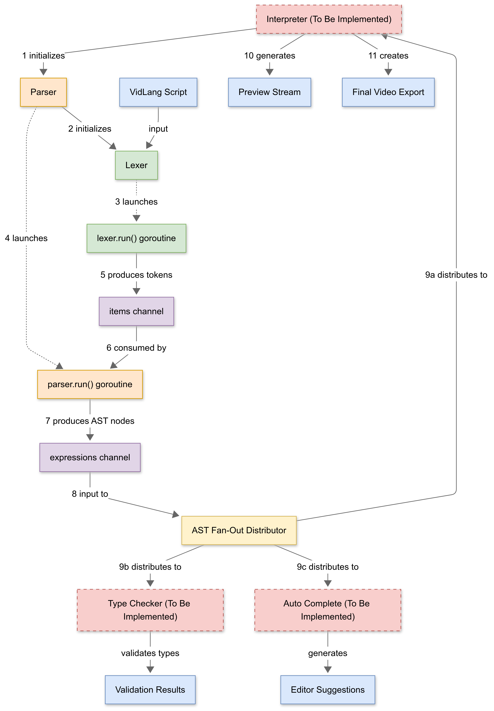

# VidLang DSL

VidLang is a domain-specific language (DSL) designed for video processing and manipulation.

## Notes

The server component was initially planned (and works) but is no longer required, as the interpreter itself supports streaming directly to any UDP-accepting video player.

## Project Structure

```bash
# Project Tree
.
├── go.mod
├── go.sum
├── main.go
├── language
│   ├── interpreter
│   │   ├── commands.go
│   │   ├── streamstore.go
│   │   └── interpreter.go
│   └── parser
│       ├── ast.go
│       ├── cmd
│       ├── item.go
│       ├── lex.go
│       ├── parse.go
│       └── utils.go
├── examples
│   ├── example1.vl
│   ├── example2.vl
│   ├── example3.vl
│   └── example4.vl

```

The DSL is located in the `language` package, which has 2 main submodules

<!--  -->
<!---->
<!-- This Activity diagram showcases the interactions between components. -->

### Parser
Lexes and parses the script.
The lexer is a hidden step in the parser module.

The Lexer specific files are:
- `./language/parser/item.go` (the tokens)  
- `./language/parser/lex.go` (the lexer implementation)
The lexer is implemented as a functional state machine, where each state returns the next and emits the found tokens to a channel.

As for the parser:
- The AST nodes are defined in `./language/parser/ast.go`
- The parser itself is in `./language/parser/parse.go`
The parser is implemented as a classic LL(3) top down recursive descent parser.
Nodes are returned and then sent through the `Expressions` channel.

#### Errors

Errors both in the lexer and parser are handled as special items (tokens) / AST Nodes.
That is via `itemError` in the lexer and `AstError` in the parser which include structured info about the problem, the line and byte position. 

This way state machines such as the lexer can be terminated gracefully,
and the above layer is aware of an underlying issue.
 

### Interpreter
The interpreter has the following features:
- Execution context done via `Context`
  - this includes all the maps necessary for accessing variables, streams and so on
- Value boxing with the help of `ValueBox`
  - This type simplifies storing of values in the `Context`.  
    It has a function for downgrading istelf to a primitive value: `boxToPrimitive()`
- the `StreamStore` stores:
  - ffmgeg streams
  - ffmpeg node splits (useful for constructing the ffmpeg execution graph)
  - split counts -- used when creating new splits in `getAuto()`
- Exporting with preview.  
  The export command has the ability to stream a preview while exporting to a udp socket.
  This stream can be played in real time by players such as `ffplay`, `mpv` and `vlc`.
  Currently the `-preview` flag opens `ffplay`.

#### Errors
The interpreter handles errors by propagading lower level errors and it's own ones via classical Golang `err` return values.
Then these errors are intercepted at the main loop and reported to the user, aborting script evaluation.

## Usage

Both the parser and interpreter are executable by their own if needed.
to run the parser:
```bash
go run ./language/parser/cmd/main.go -script <path to script>
```

To run the language itself:
```bash
go run . [-debug] [-preview] -script <path to script>
```

## Showcase

The following figure shows how the editing workflow looks. 
The editor writes commands in the editor of choice (the right pane), and after a very fast preview export they see the aproximated result in their UDP capable video player of choice. Editing and adjusting filter values and seeing how they look is as seamless as it can get:


In the demo, we used **neovim** as the code editor and **ffplay** as the preview player.
